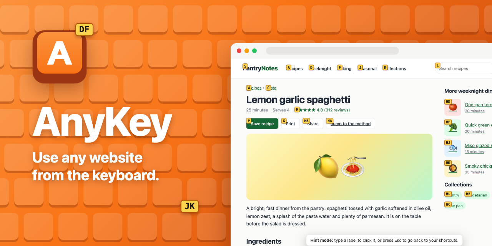
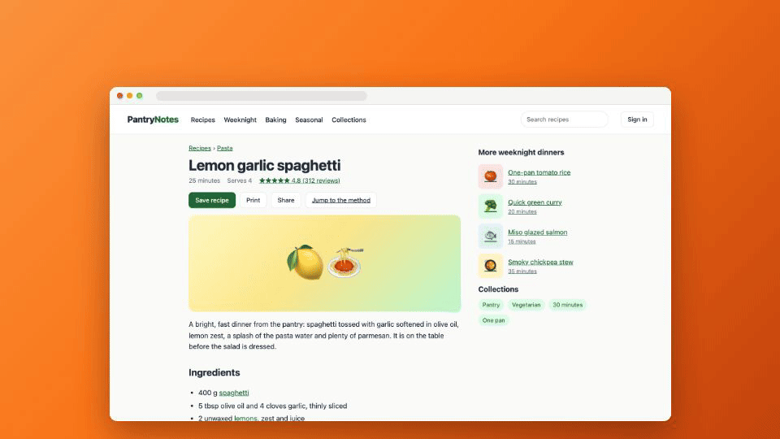
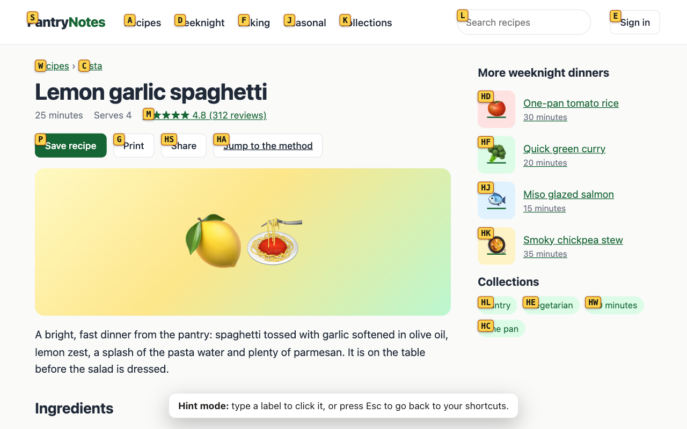
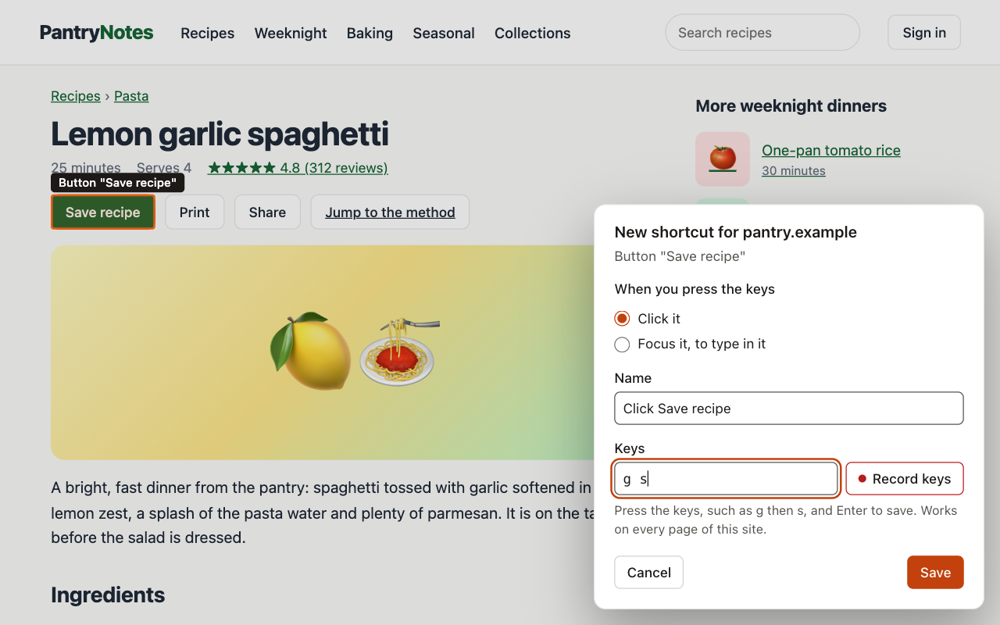
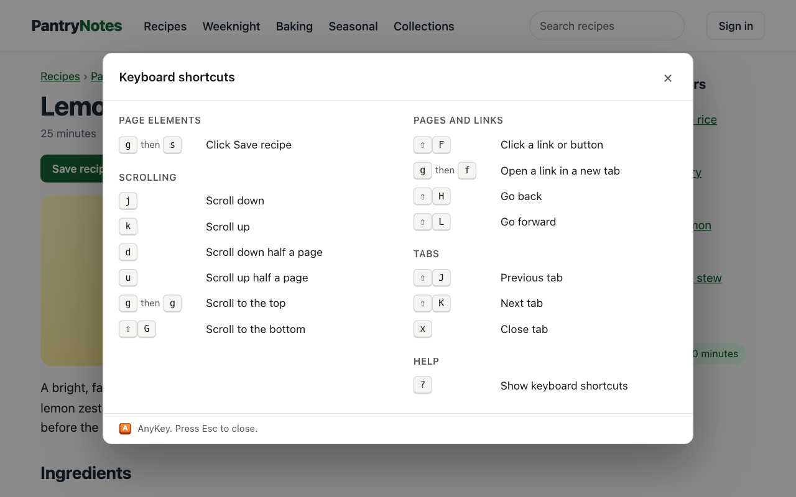
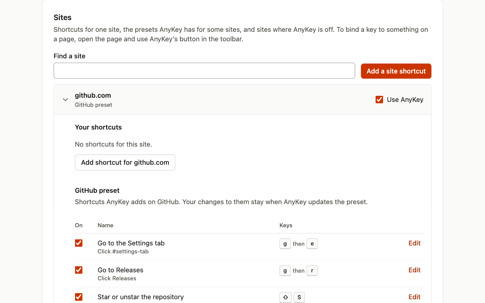

<p align="center">
  
</p>

<p align="center">
  <b>Scroll, click, switch tabs and press any button without the mouse, on every site.</b><br>
  Vimium-style link hints, a key for anything on a page, and presets for GitHub, YouTube and Reddit.
</p>

<p align="center">
  <a href="https://github.com/JatinAssudaney/AnyKey/actions/workflows/ci.yml"></a>
  
  
  <a href="PRIVACY.md"></a>
  <a href="LICENSE"></a>
</p>

<p align="center">
  <a href="#install">Install</a> ·
  <a href="#keys">Keys</a> ·
  <a href="#presets">Presets</a> ·
  <a href="https://youtu.be/DBxblfXS87c">Demo video</a> ·
  <a href="#development">Development</a>
</p>

<p align="center">
  <a href="https://youtu.be/DBxblfXS87c"></a><br>
  <sub>Link hints on a recipe page. <a href="https://youtu.be/DBxblfXS87c">Watch the 40-second demo</a>.</sub>
</p>

## What it does

<table>
  <tr>
    <td width="50%" valign="top">
      
      <p><b>Click without the mouse.</b> Press <kbd>F</kbd> and every link, button and field in view gets a label. Type the label to click it, or press <kbd>g</kbd> <kbd>f</kbd> to open a link in a new tab.</p>
    </td>
    <td width="50%" valign="top">
      
      <p><b>A key for anything.</b> Pick a button, link or field on any site and press the keys you want for it. AnyKey remembers the element several ways, so the shortcut still finds it after the site changes.</p>
    </td>
  </tr>
  <tr>
    <td width="50%" valign="top">
      
      <p><b>Every shortcut, one key away.</b> Press <kbd>?</kbd> on any page to see what works there, starting with the site's own keys on sites with a preset.</p>
    </td>
    <td width="50%" valign="top">
      
      <p><b>Presets you can change.</b> GitHub, YouTube and Reddit get keys they lack, and keep their own. Change or switch off any shortcut; yours always win over a preset's.</p>
    </td>
  </tr>
</table>

## Install

**Chrome Web Store:** AnyKey 1.0 is in review. The link goes here once it is published.

**From a release,** in Chrome, Brave or another Chromium browser:

1. Download `anykey-<version>-chrome.zip` from [Releases](https://github.com/JatinAssudaney/AnyKey/releases) and unzip it.
2. Open `chrome://extensions` (`brave://extensions` in Brave) and turn on **Developer mode**.
3. Click **Load unpacked** and pick the unzipped folder.

AnyKey starts in the tabs you already have open, without reloading them, and opens a welcome page where its keys already work.

## Keys

| Keys | What they do |
|---|---|
| <kbd>j</kbd> <kbd>k</kbd> | Scroll down, up |
| <kbd>d</kbd> <kbd>u</kbd> | Half a page down, up |
| <kbd>g</kbd> <kbd>g</kbd> &nbsp; <kbd>G</kbd> | Top of the page, bottom |
| <kbd>F</kbd> | Link hints: type a label to click it |
| <kbd>g</kbd> <kbd>f</kbd> | Link hints that open the link in a new tab |
| <kbd>H</kbd> <kbd>L</kbd> | Back, forward |
| <kbd>J</kbd> <kbd>K</kbd> | Previous tab, next tab |
| <kbd>x</kbd> | Close the tab |
| <kbd>?</kbd> | Every shortcut that works on the page |
| <kbd>Alt</kbd>+<kbd>Shift</kbd>+<kbd>K</kbd> (<kbd>⌥</kbd><kbd>⇧</kbd><kbd>K</kbd> on a Mac) | AnyKey's panel, from any tab |

Keys typed into a text field go to the field. Plain <kbd>f</kbd> stays with the site, so it still means fullscreen on YouTube. Any key can be changed or switched off in the settings, and AnyKey can be turned off for a site from its panel.

**Your own shortcuts:** click AnyKey's toolbar button, then **Add shortcut for this site**. Point at a button, link or field and click it (or press <kbd>Tab</kbd> to move and <kbd>Enter</kbd> to pick), then press the keys you want, such as <kbd>g</kbd> then <kbd>s</kbd>. The shortcut works on every page of that site.

## Presets

Presets add keys a site lacks and step aside where it has its own: on a YouTube video, <kbd>j</kbd> and <kbd>k</kbd> seek and pause as YouTube intends, and scroll everywhere else.

| Site | Keys |
|---|---|
| GitHub | <kbd>g</kbd> <kbd>r</kbd> Releases · <kbd>g</kbd> <kbd>e</kbd> Settings tab · <kbd>S</kbd> star or unstar · <kbd>C</kbd> the Code menu, to clone |
| YouTube | <kbd>g</kbd> <kbd>l</kbd> like · <kbd>g</kbd> <kbd>d</kbd> dislike · <kbd>g</kbd> <kbd>s</kbd> subscribe · <kbd>g</kbd> <kbd>c</kbd> write a comment · <kbd>g</kbd> <kbd>u</kbd> the channel |
| Reddit | <kbd>g</kbd> <kbd>h</kbd> home · <kbd>g</kbd> <kbd>p</kbd> Popular · <kbd>g</kbd> <kbd>n</kbd> notifications · <kbd>g</kbd> <kbd>m</kbd> chat · <kbd>/</kbd> search |

Want one for another site? [Request a preset](https://github.com/JatinAssudaney/AnyKey/issues/new?template=preset_request.yml).

## Privacy

AnyKey collects no data and makes no network requests. Your shortcuts stay in your browser, and sync through the browser's own sync if you have it on. [PRIVACY.md](PRIVACY.md) is the privacy policy, and [PERMISSIONS.md](PERMISSIONS.md) says why AnyKey asks for each permission.

## Development

Built with [WXT](https://wxt.dev), TypeScript, React and Tailwind (the popup and settings only), Vitest and Playwright. Requires Node 22.12+ and pnpm.

```sh
pnpm install
pnpm build          # production build in dist/chrome-mv3
pnpm dev            # watch build in dist/chrome-mv3-dev
```

Load the build at `chrome://extensions`: turn on **Developer mode**, click **Load unpacked** and pick `dist/chrome-mv3` (or `dist/chrome-mv3-dev` while `pnpm dev` runs). After a rebuild, click the reload icon on the AnyKey card: AnyKey starts again in the tabs already open, without reloading them.

```sh
pnpm check          # typecheck, lint, em-dash check, unit tests, build
pnpm test:e2e       # Playwright against the built extension, as this system and as Windows
pnpm test:live      # the GitHub and YouTube presets on the live sites, signed out
pnpm store:images   # the Chrome Web Store images, the GitHub banner, and the demo video's stills
pnpm zip            # the upload for the Chrome Web Store, dist/anykey-<version>-chrome.zip
```

The first E2E run needs Playwright's Chromium: `pnpm exec playwright install chromium`. CI runs `pnpm check` and `pnpm test:e2e` on every push.

**Docs:**

- [CLAUDE.md](CLAUDE.md): architecture and conventions
- [docs/design.md](docs/design.md): design rules and milestones
- [docs/preset-checklist.md](docs/preset-checklist.md): how to check a preset on the live site
- [store/listing.md](store/listing.md): the Chrome Web Store listing, field by field
- [store/video/README.md](store/video/README.md): the demo video, and how to make it
- [BACKLOG.md](BACKLOG.md): ideas left for later, and why they wait

## License

[MIT](LICENSE)
